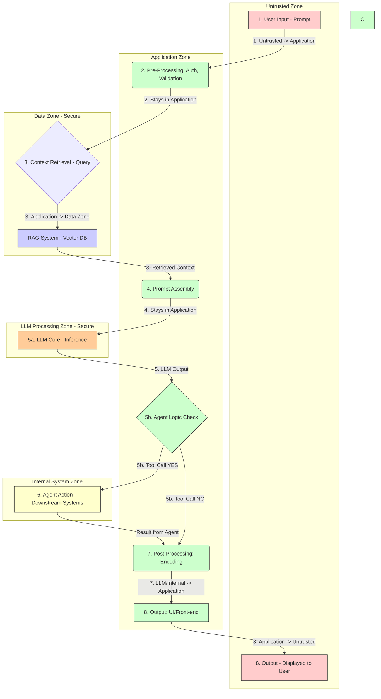

```mermaid
graph TD
    %% ------------------- Define Zones -------------------
    subgraph Untrusted Zone
        A[1. User Input - Prompt]
        L[8. Output - Displayed to User]
    end
    
    subgraph Application Zone
        B(2. Pre-Processing: Auth, Validation)
        F(4. Prompt Assembly)
        H{5b. Agent Logic Check}
        J(7. Post-Processing: Encoding)
        K[8. Output: UI/Front-end]
    end
    
    subgraph Data Zone - Secure
        D{3. Context Retrieval - Query}
        E[RAG System - Vector DB]
    end

    subgraph LLM Processing Zone - Secure
        G[5a. LLM Core - Inference]
    end

    subgraph Internal System Zone
        I[6. Agent Action - Downstream Systems]
    end

    %% ------------------- Define Flow (Numbered Steps) -------------------
    
    A -->|1. Untrusted -> Application| B;
    
    B -->|2. Stays in Application| D;
    
    D -->|3. Application -> Data Zone| E;
    E -->|3. Retrieved Context| F;
    
    F -->|4. Stays in Application| G;
    
    G -->|5. LLM Output| H; 
    
    H -- 5b. Tool Call YES --> I;
    I -->|Result from Agent| J; 
    
    H -- 5b. Tool Call NO --> J;

    J -->|7. LLM/Internal -> Application| K;
    
    K -->|8. Application -> Untrusted| L;

    %% Add clear boundary markers for context
    style A fill:#FFCCCC,stroke:#333
    style L fill:#FFCCCC,stroke:#333
    style B fill:#CCFFCC,stroke:#333
    style C fill:#CCFFCC,stroke:#333
    style F fill:#CCFFCC,stroke:#333
    style H fill:#CCFFCC,stroke:#333
    style J fill:#CCFFCC,stroke:#333
    style K fill:#CCFFCC,stroke:#333
    style E fill:#CCCCFF,stroke:#333
    style G fill:#FFCC99,stroke:#333
    style I fill:#FFFFCC,stroke:#333
```
```
