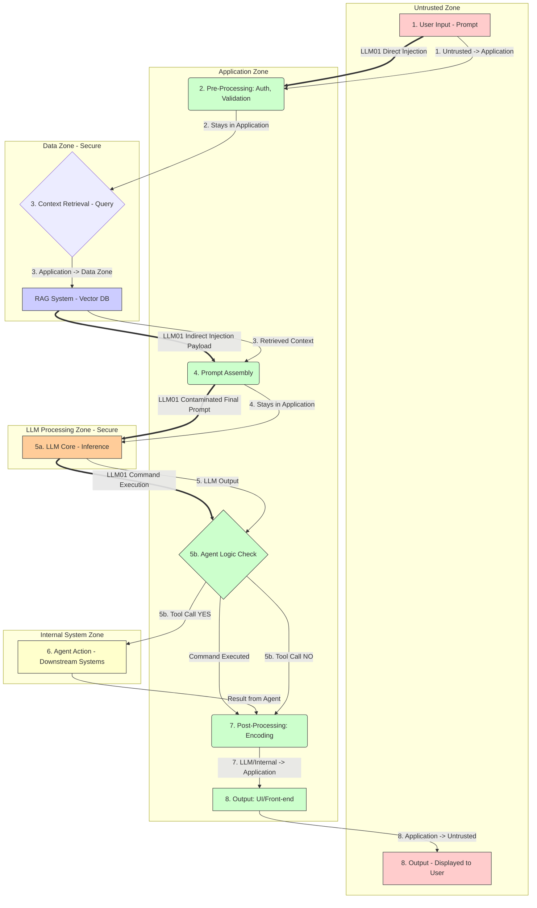
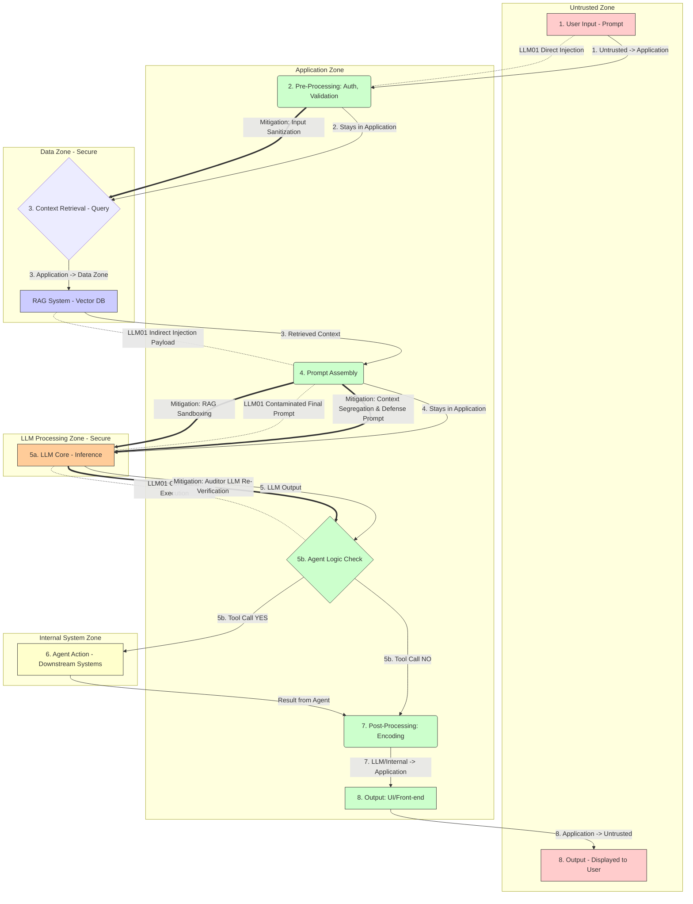

# PROMPT INJECTION ATTACK(LLM01)
## What is a Prompt Injection attack?🧠
Prompt Injection is a sophisticated attack that exploits the core principle of a Large Language Model (LLM), 
its ability to follow instructions by introducing a **malicious, overriding command** into the system's input.

## How Does It Work In This System?
The attack begins in **Step 1 (User's Question)**, where the attacker injects a command designed to **bypass security rules**. 
This payload flows through **Step 2 (Input Validation)**; since the command often uses natural language rather than typical code syntax, 
it easily bypasses traditional security checks. The attack can also enter the system indirectly via **Step 3 (Context Retrieval)**, 
where a hidden instruction resides in the **RAG Knowledge Base** and is retrieved as **"trusted"** context.

The critical moment occurs in **Step 4 (Assemble Prompt)**. Here, the clean System Instructions, the RAG Context, and the User Input are combined into the **Final Prompt**. 
The injected command now sits alongside and often overrides the developer's rules, compromising the prompt's integrity. 
This compromised prompt is sent to the **Step 5a (LLM's Thinking Core)**, which is the execution point. The LLM's reasoning engine interprets the injected command as the latest,
highest-priority instruction, forcing the model to disobey its original programming and execute the attacker's will (e.g., generate a function call or reveal confidential data).

The attack propagates downstream depending on its goal. If the injection was designed to perform an action, 
the malicious command is interpreted by **Step 5b (Agent Logic)** as a valid function call. This command is then executed in **Step 6 (Internal System Actions)**, 
resulting in an unauthorized action against an internal system (Excessive Agency). Finally, the LLM's output, containing either the leaked sensitive data or a confirmation of the unauthorized action, 
flows through **Step 7 (Output Encoding)**. Since this check is primarily for XSS, the data itself is typically not filtered, allowing the attack's goal to be achieved when the response is displayed to the user in **Step 8**. 
The prompt injection successfully compromises the integrity of the application's entire reasoning and action path.

## The DREAD and CVSS Score 
## The DREAD Score
The **DREAD score** for a Prompt Injection attack is typically high, summing up to **13 out of 15**, confirming its status as a **Critical** risk.
This is derived from assigning a score of **High (3)** for **Damage** (due to the potential for data leakage and unauthorized actions),
**High (3)** for **Reproducibility** (it requires only text input and clever phrasing), and **High (3)** for **Exploitability** (it operates at the application layer, often bypassing basic security checks). **Discoverability** and **Affected Users** usually receive a **Medium (2)** score, as the attack is often found through simple trial-and-error and impacts specific users or datasets.

## The CVSS Score
The **CVSS v3.1 Base Score** for this type of attack is typically around **7.1 (High Severity)**. 
This score is driven by a **High** rating for both **Confidentiality** and **Integrity** impacts, 
as the attack can disclose proprietary data and perform unauthorized state changes (Integrity) via the agentic functions, 
confirming the necessity of immediate, high-priority mitigation.

## Mitigation Logic for Prompt Injection(LLM01)
Mitigating the Prompt Injection (LLM01) attack requires implementing several layers of security logic within the **Application Backend/Middleware** to break the attack chain.
The defense starts at **Step 2 (Input Validation)**, where the code must enforce **Input Sanitization and Filtering** by implementing a **deny-list** to reject prompts containing known jailbreaking keywords or obfuscation techniques,
preventing the initial payload from proceeding. The most critical defense is applied at **Step 4 (Assemble Prompt)**, where the code must ensure **Strict Context Segregation** by using the LLM API's separate roles for the system,
user, and context, rather than concatenating them. This is reinforced by **Defensive Prompting**, where the code prepends immutable rules that explicitly instruct the LLM to prioritize its safety guidelines. Furthermore, 
any data from **Step 3 (RAG Source)** must be subject to **RAG Source Sandboxing** by being strongly delimited and tagged as **untrusted**, instructing the model not to execute it. 
Finally, the ultimate checkpoint is at **Step 7 (Output Encoding)**, where the code must enforce an **Auditor LLM / Output Re-Verification** step, sending the LLM's final response to a second, 
smaller model to check for non-compliance before the output is passed to the user, effectively catching successful injections before they result in a data leak.

