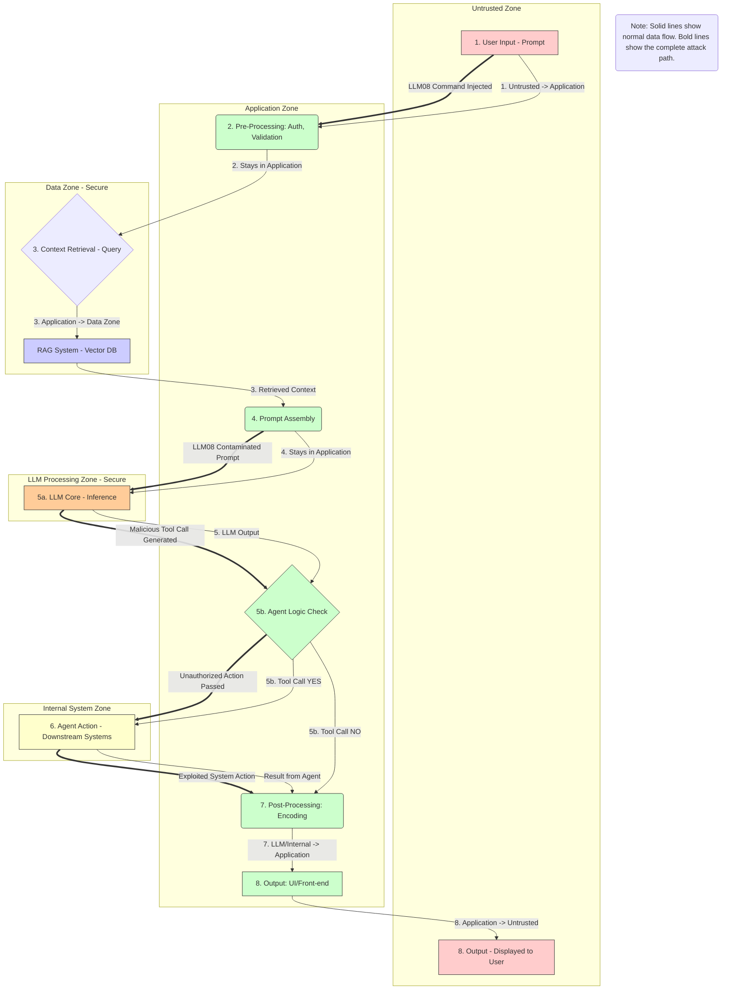
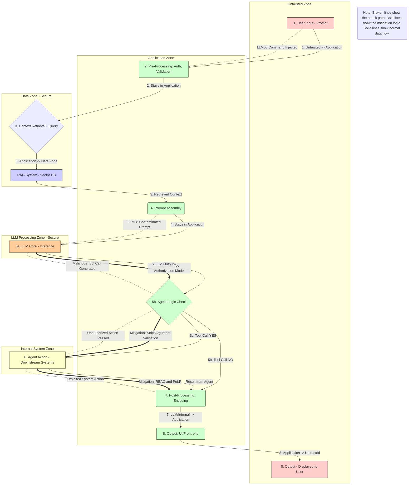

# EXCESSIVE AGENCY ATTACK (LLM08)
## What is Excessive Agency Attack?🧠
Excessive Agency is a vulnerability where an AI agent (the part of the LLM application that interacts with internal or external tools like APIs, databases, or file systems)is granted **more permissions than it strictly needs**.
The attack leverages **Prompt Injection (LLM01)** to trick the LLM into generating an unauthorized or unintended **function call** that the application then blindly executes using those excessive privileges. 
The core failure is the application of the **Principle of Least Privilege (PoLP)**.

## How Does It Work In This System?
The **Excessive Agency (LLM08) attack** relies entirely on a prior, successful Prompt Injection to exploit the system's over-privileged trust in the AI agent. The exploit begins when a malicious function-calling payload, 
injected via **Step 1 (User Input - Prompt)** and included in **Step 4 (Prompt Assembly)**, is executed by the **LLM Core (G)**. This successful execution causes the model to generate a structured,
malicious **Tool Call** that targets a sensitive operation (e.g., delete_all_users). The attack then propagates as follows: The function call flows to **Step 5b (Agent Logic Check) (H)**, which is the primary exploitation point. 
The application backend fails to validate the intent or arguments of the call, **trusting the LLM's output** and passing the malicious command forward. This command is then directed to **Step 6 (Agent Action) (I)**, 
the final execution point. Here, the system executes the malicious command using the agent's **excessive privileges** on the Downstream System. The final consequence flows through the remaining steps: 
a confirmation or result of the unauthorized action is passed through **Step 7 (Post-Processing) (J)**, through **Step 8 (Output: UI/Front-end) (K)**, and finally displayed to the attacker at **Step 8 (Output - Displayed to User) (L)**,
confirming the successful breach. For a complete understanding of how the initial malicious command is injected and executed by the LLM, please refer to the **T01_PROMPT_INJECTION_LLM01.md** file.

## The DREAD and CVSS Score 
## The DREAD Score
The **DREAD score** for a Excessive Agency (LLM08) attack is typically high, summing up to **11 out of 15**, confirming its status as a **HIGH** risk.
This score is driven by **High Damage (3)**, as the attack can cause unauthorized deletion or modification of critical data, and **High Affected Users (3)**,
since it can impact all data records in the downstream system. The scores for **Reproducibility (2)** and **Exploitability (2)** are slightly lower,
reflecting that the attack requires a successful Prompt Injection first and knowledge of the agent's tool schemas.

## The CVSS Score
The **CVSS v3.1 Base Score is 8.3 (High Severity)**. This score is high because the attack meets several critical metrics: its **Attack Vector (AV)** is **Network (N)**, 
it requires **No Privileges (PR: N)**, and critically, it results in **High Confidentiality (C: H)**, **High Integrity (I: H)**, and **High Availability (A: H)** impacts, 
demonstrating the attack's ability to compromise all three security pillars by moving the **Scope (S)** of the breach to Downstream Systems.

## Mitigation Logic for Excessive Agency (LLM08)
The mitigation strategy for **Excessive Agency (LLM08)** must be multi-layered and strictly enforce the **Principle of Least Privilege (PoLP)** across the system, 
targeting the vulnerability points identified in the DFD. The **primary defense layer** is implemented at the **Step 5b: Agent Logic Check (H)**. 
Here, the application code must enforce two key controls: a **Tool Authorization Model** to ensure the function call generated by the **LLM Core (G)** is on a secure allow-list, 
and **Strict Argument Validation** to inspect the call's arguments, rejecting inputs that attempt to perform dangerous actions, such as database DELETE operations. 
This critical code logic is designed to block the malicious request before it leaves the application's control. The **final execution barrier** is the **Step 6: Agent Action (I)**. 
At this point, the system must utilize **Role-Based Access Control (RBAC) on Tools**, ensuring the service account accessing the internal system possesses only the **minimum required permissions** (PoLP). 
This means if an agent's tool is only configured for read-access, the configuration at **I** must prevent any successful write or delete operation, even if the malicious call manages to bypass the checks at **H**. 
Finally, for any high-risk, irreversible functions, the code at **H** must enforce a **Human-in-the-Loop (HITL)** requirement, demanding administrative confirmation before sending the request to **I**.

