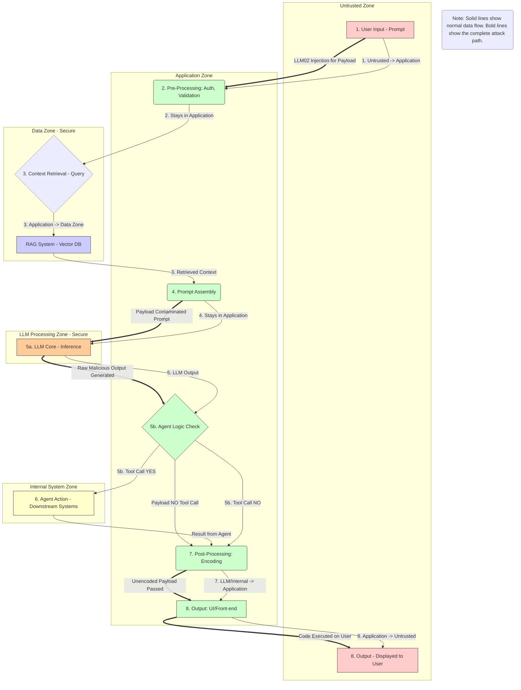

# 📝 IMPROPER OUTPUT HANDLING ATTACK (LLM02)
## What is Improper Output Handling? 🧠
Improper Output Handling is a vulnerability where an LLM generates a response containing **malicious code, 
unsafe characters, or unvalidated data** that is then passed directly to a downstream system (like a browser or an internal API)
without adequate sanitization or encoding.2 The attack leverages the LLM's ability to generate code (like HTML, Markdown, or JSON) 
to perform Cross-Site Scripting (XSS), SQL Injection, or other injection attacks on the component that processes its output. 
The core failure is the lack of **context-aware encoding** at the point of display.

## How Does It Work In This System?💥
The **Improper Output Handling (LLM02) attack** works by exploiting the application's reliance on the **LLM Core (G)** to produce safe output. 
The attack is initiated by a successful Prompt Injection, where the attacker's command is executed by the **LLM Core (G)**, 
causing the model to generate a **raw**, **malicious payload** (e.g., a JavaScript <script> tag) instead of a benign text answer. 
The attack then propagates as this malicious output flows through the system. Since the LLM output is not a tool call, 
it skips **Step 5b (Agent Logic Check) (H)** and moves directly to **Step 7 (Post-Processing: Encoding) (J)**. 
This step is the primary failure point, as the application's code is either **missing sufficient sanitization or fails to implement context-aware encoding**, 
allowing the raw, executable payload to pass through unharmed. The malicious output is then passed to **Step 8 (Output: UI/Front-end) (K)** 
and is finally executed by the victim's browser when displayed at **Step 8 (Output - Displayed to User) (L)**, resulting in a client-side attack like XSS.
For a full explanation of the injection process, please refer to the **T01_PROMPT_INJECTION_LLM01.md** file.   




## The DREAD and CVSS Score 
## The DREAD Score
The **Improper Output Handling (LLM02) attack** is consistently rated as a **CRITICAL/HIGH** risk, confirmed by a DREAD score totaling **14 out of 15**. 
This high score is driven by **High (3)** ratings for **Damage**, **Reproducibility**, and **Exploitability**, 
as the attack can cause session hijacking or credential theft and requires only a simple, clever prompt to bypass common security checks.

## The CVSS Score
The **CVSS v3.1 Base Score is 7.6 (High Severity)**, reflecting the attack's strong impact on the user's side. 
The score is high due to **High Confidentiality (C: H)** and **High Integrity (I: H)** impacts, as the attacker can steal user cookies or modify content. 
Crucially, its **Attack Complexity (AC: L)** is low, and its **Scope (S)** is **Unchanged (U)**, 
meaning the attack is easy to execute and targets the user's browser rather than the backend LLM system itself.

## Mitigation Logic for Improper Output Handling (LLM02) 🛡️
Mitigation for **Improper Output Handling (LLM02)** is concentrated almost entirely on preventing the malicious output from becoming executable code at the point of display. 
The primary defense must be implemented at **Step 7 (Post-Processing: Encoding) (J)**, which is the code responsible for validating the LLM's final response. 
This code must strictly enforce **Context-Aware Output Encoding**, converting special characters in the response into harmless equivalents (e.g., < becomes &lt;) 
based on where the output will be rendered (HTML, Markdown, etc.). If the application requires displaying some safe formatting,
the code at **J** must also apply a **Strict Sanitization Policy** using an allow-list-based sanitizer to remove all unsafe elements (like <script>). 
This logic ensures that the raw output generated by the **LLM Core (G)** is neutralized before it is passed to **Step 8 (Output: UI/Front-end) (K)** for final display to the user.

```mermaid
graph TD
    NOTE(Note: Broken lines show the attack path. Bold lines show the mitigation logic. Solid lines show normal data flow.)
    
    %% ------------------- Define Zones -------------------
    subgraph Untrusted Zone
        A[1. User Input - Prompt]
        L[8. Output - Displayed to User]
    end
    
    subgraph Application Zone
        B(2. Pre-Processing: Auth, Validation)
        F(4. Prompt Assembly)
        H{5b. Agent Logic Check}
        J(7. Post-Processing: Encoding)
        K[8. Output: UI/Front-end]
    end
    
    subgraph Data Zone - Secure
        D{3. Context Retrieval - Query}
        E[RAG System - Vector DB]
    end

    subgraph LLM Processing Zone - Secure
        G[5a. LLM Core - Inference]
    end

    subgraph Internal System Zone
        I[6. Agent Action - Downstream Systems]
    end

    %% ------------------- Define Clean Data Flow (Solid Lines) -------------------
    
    A -->|1. Untrusted -> Application| B;
    B -->|2. Stays in Application| D;
    D -->|3. Application -> Data Zone| E;
    E -->|3. Retrieved Context| F;
    F -->|4. Stays in Application| G;
    G -->|5. LLM Output| H;
    H -- 5b. Tool Call YES --> I;
    I -->|Result from Agent| J;
    H -- 5b. Tool Call NO --> J;
    J -->|7. Post-Processing -> UI/Front-end| K;
    K -->|8. Output -> Untrusted| L;

    %% ------------------- Define Attack and Mitigation Flow -------------------
    
    A -.-|LLM02 Injection for Payload| B;
    F -.-|Payload Contaminated Prompt| G;
    G -.-|Raw Malicious Output Generated| H;
    H -- Payload NO Tool Call -.- J;
    J ==>|Mitigation: Context-Aware Encoding & Sanitization| K;
    K -.-|Unencoded Payload Executed| L;

    %% Add clear boundary markers for context
    style A fill:#FFCCCC,stroke:#333
    style L fill:#FFCCCC,stroke:#333
    style B fill:#CCFFCC,stroke:#333
    style F fill:#CCFFCC,stroke:#333
    style H fill:#CCFFCC,stroke:#333
    style J fill:#CCFFCC,stroke:#333
    style K fill:#CCFFCC,stroke:#333
    style E fill:#CCCCFF,stroke:#333
    style G fill:#FFCC99,stroke:#333
    style I fill:#FFFFCC,stroke:#333
```
