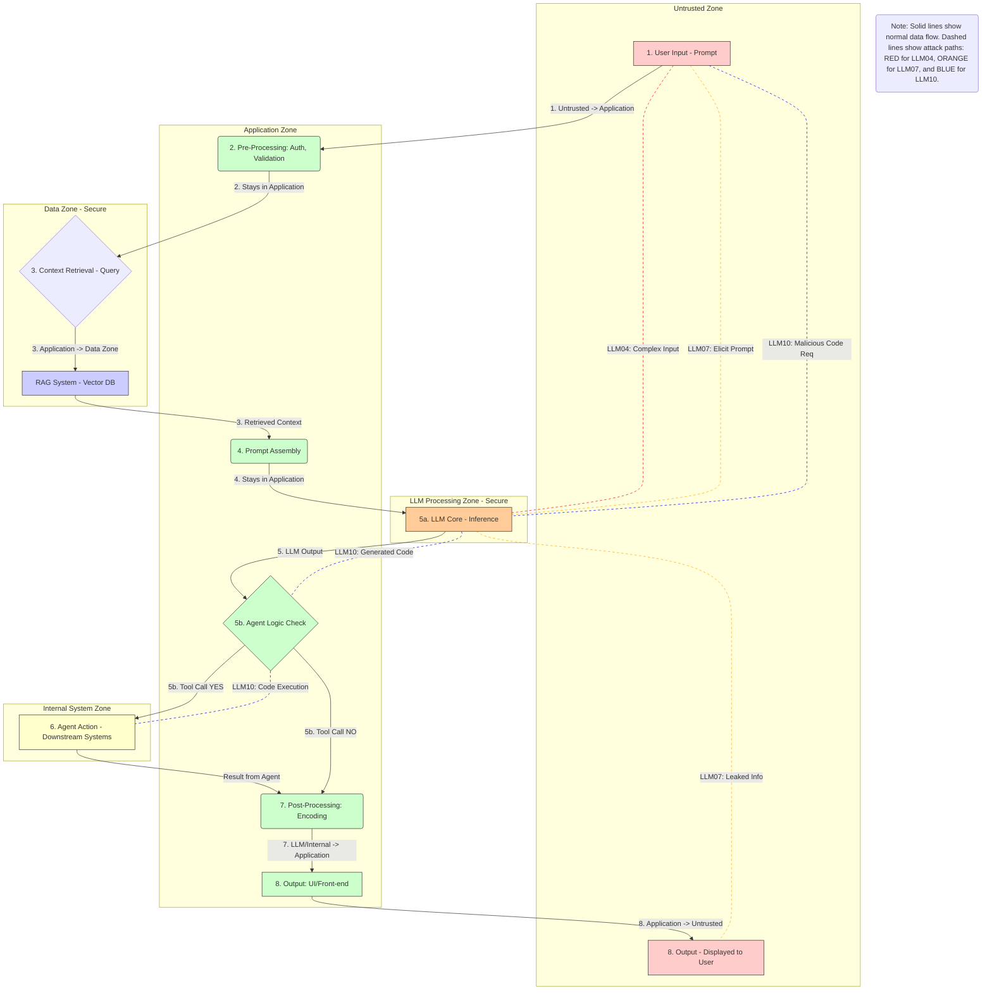
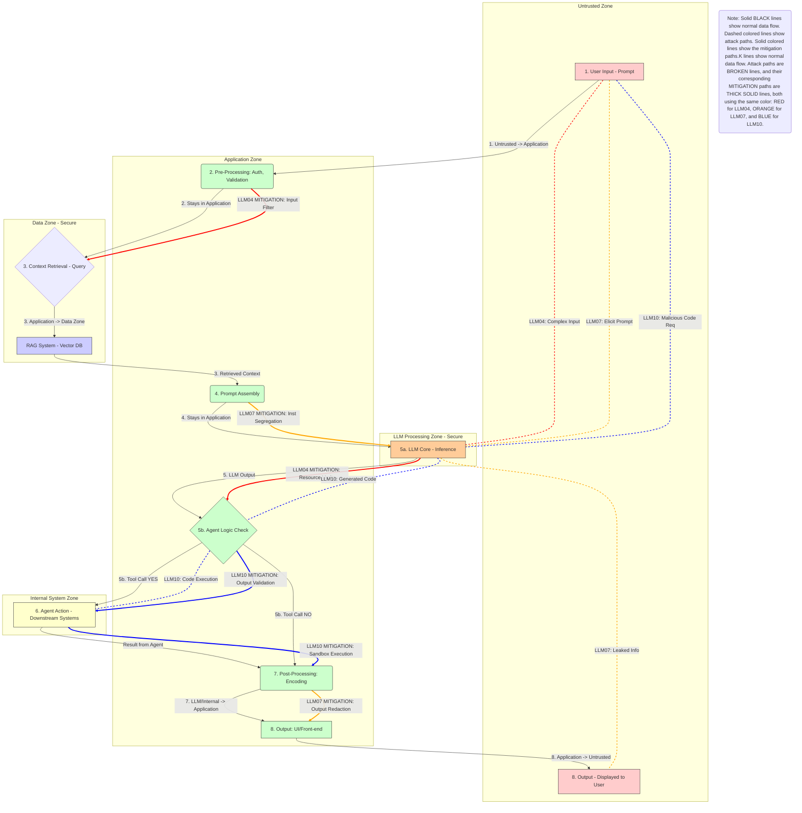

# OVERVIEW🛡️
Medium risk LLM attacks are vulnerabilities that, while potentially significant, are typically easier to defend against than high-risk attacks or are constrained by the secured,
offline nature of your system. They primarily target the resource consumption, build environment, or internal data leakage paths.
## Model Denial of Service (LLM04)
## What is A Model Denial of Service?🧠
A **Model Denial of Service attack** aims to overwhelm the LLM's computational resources by sending an extremely long, complex, or computationally intensive input.
Even in an **offline, secured system**, a successful LLM04 attack can lead to excessive resource consumption, high processing latency, or even system crashes, 
making the application unusable for legitimate internal users

## How Does It Work In This System?💥
The **Model Denial of Service (LLM04)** attack is initiated at **Step 1 (User Input - Prompt)** or **Step 4 (Prompt Assembly)**. The attacker submits an excessively large, 
complex, or computationally demanding input (e.g., a massive block of text to summarize, an extremely complex prompt requiring deep iterative reasoning, or repetitive tokens designed to induce slow processing).
This payload flows directly to the **LLM Core (G)**. Although your system is offline and secured, the attack exploits the **finite computational resources** of the inference hardware. 
The large input causes the **LLM Core (G)** to spend an excessive amount of time and memory processing the request, potentially exhausting the thread pool, consuming all available CPU/GPU resources, 
or triggering high costs if usage is metered internally. The result is a **denial of service** for other internal users who cannot access the model due to resource exhaustion, even though the system is secured.

## Training Data Poisoning (LLM06)
## What is Training Data Poisoning (LLM06)?🧠
**Training Data Poisoning (LLM06)** is a pre-deployment threat where malicious data is covertly introduced into the dataset used to train or fine-tune the LLM.
The goal is to inject vulnerabilities, biases, or backdoors into the model itself, causing it to generate unauthorized or harmful output only when triggered by a specific, subtle prompt during operation.

## How Does It Work In This System?🦠
The **Training Data Poisoning (LLM06)** attack occurs entirely **before the system is deployed** and is not initiated at a live DFD step. 
This attack involves an insider or an attacker who has compromised the development environment to inject malicious, subtle "poison" into the dataset used to train or fine-tune the LLM. 
The poisoned data establishes a **hidden backdoor** in the model's weights. During live operation, the attack is triggered when a seemingly benign input is fed into the system via **Step 1** or **Step 4**.
When this input reaches the **LLM Core (G)**, the hidden trigger causes the model to generate a harmful output (e.g., biased content or sensitive internal information) that would otherwise be blocked, 
successfully subverting the secured training process.

## Sensitive Information Disclosure (LLM07)
## What is Sensitive Information Disclosure (LLM07)?🧠
**Sensitive Information Disclosure (LLM07)** occurs when the LLM inadvertently leaks confidential data or proprietary information that it was not supposed to expose.
In a **secured system**, this usually involves the LLM being tricked into revealing its own **secured internal system prompt** or exposing parts of its own internal knowledge base/context.

## How Does It Work In This System?🕵️
The **Sensitive Information Disclosure (LLM07)** attack aims to trick the LLM into leaking proprietary information, such as the confidential system prompt or internal documentation. 
The attack is initiated via a malicious request at **Step 1 (User Input - Prompt)** or by contaminating the RAG context in **Step 4 (Prompt Assembly)**. The payload flows to the **LLM Core (G)**, 
where it exploits the model's tendency to obey instructions or complete patterns. The attack bypasses the model's built-in safety mechanisms and causes the **LLM Core (G)** to output sensitive context that was passed in the Prompt Assembly (F), 
such as the secret instructions defining its identity and safety rules. The resulting sensitive text then flows to **Step 8 (Output - Displayed to User) (L)**, resulting in a crucial loss of confidential system architecture details.

## Supply Chain Vulnerabilities (LLM09)
## What is Supply Chain Vulnerabilities (LLM09)?🧠
**Supply Chain Vulnerabilities (LLM09)** is a risk introduced through insecure third-party components, libraries, or service APIs used during the building, deployment, or continuous integration of the LLM application. 
An attacker exploits vulnerabilities in dependencies (e.g., Python packages, container images, or model weights) used to run the **offline** application, rather than attacking the LLM via prompt injection.

## How Does It Work In This System?📦
The **Supply Chain Vulnerabilities (LLM09)** attack targets the dependencies used to build and run the LLM application and does not originate from a user input step. 
This attack vector focuses on compromising the environment **outside of the direct LLM inference loop**. Examples include exploiting vulnerabilities in third-party Python libraries, container base images (used in the secured offline environment),
or model weight files before they are deployed. A successful compromise, which may occur before the application is even in production, can lead to the remote execution of unauthorized code on the LLM's server when the component is loaded. 
This grants the attacker a foothold in your secured environment, bypassing all runtime DFD checks.

## Insecure Handling of Third-Party Code/Plugins (LLM10)
## What is Insecure Handling of Third-Party Code/Plugins (LLM10)?🧠
**Insecure Handling of Third-Party Code/Plugins (LLM10)** arises when the application executes code (such as Python, SQL, or shell commands) generated by the LLM via an agent or plugin layer.
While the model is **offline and secured**, if it can still generate commands that are run by an internal execution engine, an attacker might generate malicious code designed to escape its sandbox and harm the local environment.

## How Does It Work In This System?💻
The **Insecure Handling of Third-Party Code/Plugins (LLM10)** attack begins with a prompt injection at **Step 1** or **Step 4** that requests the LLM to generate malicious code (e.g., a destructive shell command or a sandbox-escaping Python script). 
This request reaches the **LLM Core (G)**, which outputs the malicious code as a function call or structured text. The failure point occurs at **Step 6 (Agent Action - Downstream Systems) (I)**, where the application code executes the generated code within a plugin or sandbox. 
The attack succeeds when the executed code is either **poorly validated** by the Agent Logic Check (**H**) or when the execution environment (**I**) fails to **properly isolate** the LLM's code from the host system, allowing the code to break out of the sandbox and execute commands on the secured host.

## The DREAD and CVSS Scores 
## The DREAD Scores
## Model Denial of Service (LLM04)
The **DREAD score** for Model Denial of Service is typically high, summing up to **13 out of 15**, confirming its status as a **Critical** risk.
This is derived from assigning a score of **High (3)** for **Affected Users** (Impacts all internal users relying on the offline LLM service.),
**High (3)** for **Reproducibility** (Very easy to reproduce by submitting a large/complex input.), and **High (3)** for **Exploitability** (No specialized tools or knowledge required; standard user input is sufficient). 
**Discoverability** and **Damage** usually receive a **Medium (2)** score, as it is Detectable through latency monitoring and resource usage logs and Causes service interruption or high unexpected costs, but no data breach.

## Training Data Poisoning (LLM06)
The **DREAD score** for Training Data Poisoning totals **9/15 (Medium Risk)**, as the threat relies on low-probability events, even though the resulting damage is high. 
The rating is driven by **High Damage (3)** and **High Affected Users (3)**, since a successful attack permanently compromises the model's integrity with backdoors or biases, 
affecting every user's output. However, the risk is mitigated by **Low Reproducibility (1)** and **Low Exploitability (1)** because the attack requires specialized access and knowledge of the secure, 
internal training pipeline, and **Low Discoverability (1)**, as the subtle poisoned data is extremely difficult to detect within a large dataset or through normal runtime monitoring.

## Sensitive Information Disclosure (LLM07)
The **DREAD score** for Sensitive Information Disclosure totals **11/15 (HIGH Risk)**, primarily driven by the severity of the potential data loss. The rating is high due to **High Damage (3)**,
as leaking the secured system prompt or confidential RAG data fundamentally compromises the system's operational security and trade secrets. This high damage is combined with **Medium Reproducibility (2)** and **Medium Exploitability (2)**,
as the attack requires a carefully crafted prompt injection to bypass defenses. **Medium Affected Users (2)** and **Medium Discoverability (2)** scores reflect that while the disclosure is visible in the output, 
it may be mistaken for a normal LLM reply, masking the malicious intent.

## Supply Chain Vulnerabilities (LLM09)
The **DREAD score** for Supply Chain Vulnerabilities totals **10/15 (MEDIUM Risk)**, positioning it as a significant but less frequently realized threat compared to direct prompt attacks. 
This score is heavily influenced by **High Damage (3)** and **High Affected Users (3)**, as a successful compromise of a dependency can grant an attacker **Remote Code Execution (RCE)** on the secured host server, 
impacting all users. However, the score is brought down by **Low Reproducibility (1)** and **Low Discoverability (1)**. 
This is because the attack requires exploiting a vulnerability in a third-party package (not reproducible by a standard user) and the flaw is often hidden deep within the build environment, making it difficult to find.

## Insecure Handling of Third-Party Code/Plugins (LLM10)
The **DREAD score** for Insecure Handling of Third-Party Code/Plugins totals **11/15 (HIGH Risk)**, positioning it as a severe threat due to its destructive potential. The high rating is primarily driven by **High Damage (3)**, 
as a successful attack can result in a sandbox escape and full host system compromise, and **Medium Affected Users (2)**, as a compromised execution environment affects service for many internal users. 
The risk is constrained slightly by **Medium Reproducibility (2)** and **Medium Exploitability (2)**, as the attacker must successfully craft a prompt payload that not only tricks the LLM into generating code but also bypasses the Agent Logic Check and the sandbox's defenses.

## The CVSS Score
## Model Denial of Service (LLM04)
The **CVSS v3.1 Base Score** for the **Model Denial of Service (LLM04)** attack is **7.5 (High Severity)**. This score is primarily driven by the attack's ability to cause a total service disruption, 
evidenced by a **High Availability (A: H)** metric. The attack is launched over the **Network (AV: N)** with **Low Attack Complexity (AC: L)**, as it requires only submitting an excessively large or demanding input. 
The attacker needs **No Privileges (PR: N)**, and no other user interaction is required. Although the attack does not compromise data integrity or confidentiality (**C: L, I: L**), it results in a **Changed Scope (S: C)**
because it consumes the internal resources of the secured LLM host system, directly disrupting service for all internal users.

## Training Data Poisoning (LLM06)
The **CVSS v3.1 Base Score** for Training Data Poisoning is **7.0 (High Severity)**. The attack's complexity and requirements are captured by a **High Attack Complexity (AC: H)** metric, as an attacker needs significant access to the secured, 
offline data pipeline and must carefully craft the poisoned data. The severity is confirmed by a **High Integrity (I: H)** metric, as the fundamental correctness and safety of all model outputs are permanently corrupted. 
The attack results in a **Changed Scope (S: C)** because it subverts the model's core logic. Although the attack does not directly compromise availability or confidentiality, the irreversible damage to the model's trustworthiness results in a high-severity rating.

## Sensitive Information Disclosure (LLM07)
The **CVSS v3.1 Base Score** for Sensitive Information Disclosure is **7.4 (High Severity)**. This score is primarily dictated by a **High Confidentiality (C: H)** impact, as the core purpose of the attack is the unauthorized theft of sensitive, 
non-public system configuration (like the master prompt). The attack has **Low Attack Complexity (AC: L)**, as it exploits the LLM's behavioral weaknesses rather than a complex code vulnerability, and requires **No Privileges (PR: N)**.
The result is a **Changed Scope (S: C)** because the breach moves from the user's prompt into revealing the integrity of the secured, internal system context.

## Supply Chain Vulnerabilities (LLM09)
The **CVSS v3.1 Base Score** for Supply Chain Vulnerabilities is an exceptionally high **9.8 (Critical Severity)**. This rating is based on the highest possible impact across all three primary metrics: **High Confidentiality (C: H)**, **High Integrity (I: H)**, 
and **High Availability (A: H)**. A compromise bypasses the application and gives the attacker full control over the host system. The attack requires **No Privileges (PR: N)** and has **Low Attack Complexity (AC: L)**, 
as exploiting a known vulnerability in a dependency is often straightforward, leading to a **Changed Scope (S: C)** and immediate, critical compromise of the secured environment.

## Insecure Handling of Third-Party Code/Plugins (LLM10)
The **CVSS v3.1 Base Score** for Insecure Handling of Third-Party Code/Plugins is **7.1 (High Severity)**. This score is justified by the attack's high impact on data, resulting in both **High Confidentiality (C: H)** and **High Integrity (I: H)**, 
as a successful escape allows unauthorized access to and modification of host system data. The attack is launched over the **Network (AV: N)** but features **High Attack Complexity (AC: H)**, 
reflecting the multiple security layers (tool validation and sandbox) that must be defeated to execute the code. The attack leads to a **Changed Scope (S: C)** by moving from the LLM's virtual environment to the underlying host system, granting critical access.

## TECHNICAL MITIGATION PROPOSALS
## Model Denial of Service (LLM04)⚙️
Mitigation for LLM04 must prioritize resource protection and input control. This is implemented via two main checks: a **Pre-Processing Input Filter** at **Step 2 (B)**, which enforces strict character and token limits on all incoming requests to prevent large payloads from reaching the LLM Core. 
This is complemented by **Runtime Resource Limits** within the **LLM Processing Zone (G)** itself, which uses server configuration (e.g., maximum GPU time per request, CPU time limits) to automatically throttle or terminate any request that exceeds a predefined threshold, 
ensuring a single complex prompt cannot monopolize system resources.

## Training Data Poisoning (LLM06)🧪
Mitigation for data poisoning (LLM06) occurs entirely in the **Data Zone (E)** and the system's external MLOps pipeline, targeting the security of the model's creation. Implementation requires a **Data Integrity Pipeline** that uses automated scanning and statistical analysis on the training data before it is used to train the model, 
specifically looking for anomalies, outliers, and corrupted data patterns. Furthermore, **Model Auditing** must be conducted post-training but pre-deployment, utilizing adversarial testing and perturbation analysis to actively probe the resulting LLM for known poisoning backdoors and ensure the model's weights remain secure.

## Sensitive Information Disclosure (LLM07)🔒
Mitigation for LLM07 requires layered controls to prevent the LLM from revealing its context. This is achieved through **Instruction Segregation** within **Step 4 (Prompt Assembly) (F)**, where the sensitive system prompt is passed to the LLM as a distinct, 
unmodifiable system instruction that is isolated from user input. This is combined with **Output Redaction/Filtering** at **Step 7 (Post-Processing: Encoding) (J)**. The post-processing code should maintain a blacklist of sensitive keywords 
(e.g., internal function names, confidential prompt phrases) and strip, mask, or replace these items from the **LLM Core (G)** output before the final result is sent to the user at **Step 8 (L)**.

## Supply Chain Vulnerabilities (LLM09)📦
Mitigation for LLM09 is purely infrastructural and focuses on securing the deployment environment used to run the secured, offline system. This is implemented through **Continuous Dependency Scanning** (external to the DFD runtime), where all third-party libraries, 
packages, and Docker container base images are automatically audited for known vulnerabilities before deployment. Additionally, the execution environment for the **Internal System Zone (I)** must employ **Strict Environment Hardening** to enforce the principle of least privilege at the operating system level,
ensuring that even if a vulnerable dependency is exploited, it lacks the permissions needed to perform destructive actions on the host.

## Insecure Handling of Third-Party Code/Plugins (LLM10)💻
Mitigation for LLM10 requires securing both the code generation and execution phases. This starts with **Output Validation** at **Step 5b (Agent Logic Check) (H)**, where the application code must strictly validate the syntax and content of any code generated by the **LLM Core (G)** against an allow-list of safe functions and parameters before execution. 
Critically, execution at **Step 6 (Agent Action - Downstream Systems) (I)** must always occur within a dedicated, heavily restricted **Sandbox Environment** (like a jailed container or a virtual machine). This sandbox ensures that even if malicious code is executed, 
it is perfectly isolated from the host operating system and cannot cause any damage outside the limited, single-purpose environment.

